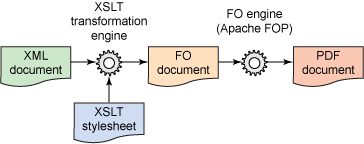

# Language-agnostic ways to render PDFs

Overview of best solutions (at least these I tried so far).


---


## Boss: Customer wants to generate PDF reports. How long it will take?


---


# Tools that we will look at

## HTML is converted to PDF

* `electron-pdf`
* `wkhtmltopdf`
* Headless browsers
  * PhantomJS
  * Chrome

## Domain specific language is converted to PDF

* LaTeX
* XSL-FO

---


---


# LaTeX

* Built on top of TeX

# Pros

* You probably already know it (if you were in academia)
* Allow almost arbitrary design
* Exceptionally good for mathematics
* There are free templates to start with
* You can outsource it to professional
* Very predictable results
* Many professional-grade editors with live preview

# Cons

* There is a good chance that your front-end developer don't know it
* Can require processing - vector images are not supported
* Learning curve isn't great
* Requires ~1GB of space on disk - can be a problem on cheap VPS


---


This code was 
[taken from latextemplates.com](https://www.latextemplates.com/template/invoice).
Styling is present in file not included here.

```latex
\documentclass{invoice} % Use the custom invoice class (invoice.cls)
\def \tab {\hspace*{3ex}} % Define \tab to create some horizontal white space
\begin{document}
\hfil{\Huge\bf Initech Inc.}\hfil % Company providing the invoice
\bigskip\break % Whitespace
\hrule % Horizontal line
123 Broadway \hfill (000) 111-1111 \\ % Your address and contact information
City, State 12345 \hfill john@smith.com
\\ \\
{\bf Invoice To:} \\
\tab James Smith \\ % Invoice recipient
\tab Generic Corporation \\ % Recipient's company
{\bf Date:} \\
\tab \today \\ % Invoice date
\begin{invoiceTable}
\feetype{Consulting Services} % Fee category description
\hourrow{October 3, 2012}{8}{12} 
\subtotal % Prints a subtotal, can be used multiple times
\feetype{Hosting Expenses} % Fee category description
\feerow{Web Hosting: October, 2012}{60}
\end{invoiceTable}
\end{document}
```

---


It's very simple to get PDF file from LaTeX input.
```shell
$ sudo apt-get install texlive-latex-base texlive-latex-extra
$ pdflatex invoice.tex invoice.pdf
```

---


<center>
    
</center>

---


# XSL - FO

<center>
    
</center>

---


# XSL - FO (XSL Formatting Objects)

* XML
* Traditionally used with XSLT - XSL Templates (yay, more XML)

# Pros

* XML feels like enterprise

# Cons

* Limited tooling - you can get **Apache FOP** for free or pay 5000 dollars for commercial tools
* Formatting and text setting is poor - on par with CSS1/CSS2 possibilities (and often worse)
* Almost no community
* Prehistoric - last specification version was released 5 years ago
* Writing XML by hand is a pain. Writing XSLT - too.
* Formatting must be done inline - styles and content aren't separated at all
  * People use templates as workaround

---


```xml
<fo:root xmlns:fo="http://www.w3.org/1999/XSL/Format">
  <fo:layout-master-set>
    <fo:simple-page-master master-name="A4-portrait"
          page-height="29.7cm" page-width="21.0cm" margin="2cm">
      <fo:region-body/>
    </fo:simple-page-master>
  </fo:layout-master-set>
  <fo:page-sequence master-reference="A4-portrait">
    <fo:flow flow-name="xsl-region-body">
      <fo:block>
        Hello, World!
      </fo:block>
    </fo:flow>
  </fo:page-sequence>
</fo:root>
```
Yes, that's Hello World. And it's going to be worser.

---


```shell
$ sudo apt-get install fop
$ fop hello_world.fo hello_world.fo
```

---


<center>
    
</center>

---


# HTML and CSS

# Pros

* You already know it
* Existing views can be used as template
* Live preview in browser

# Cons

* Heavy weight tools
  * Electron use 90MB of memory only to display _help_ in console.
  * Chrome use 180MB of memory only to display start page.
  * These values doesn't include shared memory - it can be higher on server.
* No commercial support
* Installation can be cumbersome in some cases

---


Invoice code based on 
[github.com/sparksuite/simple-html-invoice-template](https://github.com/sparksuite/simple-html-invoice-template)
(MIT license)

```html
<html>
<head>
    <link type="text/css" rel="stylesheet" href="style.css">
</head>
<body>
    <div class="invoice-box">
        <table cellpadding="0" cellspacing="0">
            <tr class="heading">
                <td>Item</td>                
                <td>Price</td>
            </tr>
            <tr class="item last">
                <td>Domain name (1 year) </td>
                <td>$10.00</td>
            </tr>
            <tr class="total">
                <td></td>
                <td>Total: $385.00</td>
            </tr>
        </table>
    </div>
</body>
</html>
```

---


PhantomJS as headless WebKit isn't designed to generate PDFs. But we can do it!

We need to install it: 
```
$ wget https://bitbucket.org/ariya/phantomjs/downloads/phantomjs-2.1.1-linux-x86_64.tar.bz2
$ tar xvjf phantomjs-2.1.1-linux-x86_64.tar.bz2
$ sudo cp ./phantomjs-2.1.1-linux-x86_64/bin/phantomjs /usr/local/bin
$ phantomjs script.js
```

And script.js must look like:

```javascript
var page = require('webpage').create();
page.open('file://path/to/our/file', function() {
    page.render('output.html');
    phantom.exit();
});
```

As we see, it requires creation of new process every time we need PDF. 
Even if we parametrize this script 
(as it was already done in [official example rasterize.js](https://github.com/ariya/phantomjs/blob/master/examples/rasterize.js)
it's less than ideal.

We have three solutions for this:
* learn to live with it
* write Node.js microservice using `phantom` module and pooling processes
* write your own implementation of PhantomJS controller (Phantom allow to expose simple HTTP based API)

---


With `electron-pdf` module we can convert files by command line from any language.
```shell
$ npm install -g electron-pdf
$ sudo apt-get install xvfb # X11 server working in-memory
$ export DISPLAY=':99.0'
$ Xvfb :99 -screen 0 1024x768x24 > /dev/null 2>&1 &
$ electron-pdf source.html output.html
```

Though spawning heavy process for each PDF isn't good idea.
On my i5-6600 spawning process takes 350ms 
and similar single-core performance  on server would significantly damage your company budget.

`electron-pdf` expose programmatic API for this case, but only for Node. 

Though, writing microservice for this task is easy-peasy - 
it took less than 100 lines of code for me (but still too big to place it here).

---


`wkhtmltopdf` is simple tool built on top of QtWebKit. 
It's easy to use from C and other languages providing bindings for C (like Java)... Or just from command line.

```shell
$ sudo apt install wkhtmltopdf
$ wkhtmltopdf invoice.html output.html
```

`wkhtmltopdf` is solid solution, but it uses rather outdated `QtWebKit`.

Its engine is over 2 years now and doesn't support most recent CSS and HTML features.
Support for capturing SPA is limited too.


---


# Electron
<center>
    
</center>

---


# Phantom

<center>
    
</center>

---


# wkhtmltopdf

<center>
    
</center>

---


<table id="compare">
   <style scoped>
   td {
       padding: 0.5em;
   }

    thead {
        font-size: 150%;
    }
   </style>
   <thead>
         <tr>
            <td></td>
            <td>Phantom</td>
            <td>wkhtml2pdf</td>
            <td>Electron</td>
         </tr>
   </thead>
   <tbody>
        <tr>
           <td>Rendering engine</td>
           <td>WebKit</td>
           <td>QtWebKit</td>
           <td>Blink</td>
        </tr>
      <tr>
         <td>Engine release date</td>
         <td>N/A</td>
         <td>03/2015</td>
         <td>2017</td>
      </tr>
      <tr>
         <td>Java/C#/Python bindings</td>
         <td>no</td>
         <td>yes</td>
         <td>no</td>
      </tr>
      <tr>
         <td>Memory usage</td>
         <td>50MB</td>
         <td>80MB</td>
         <td>105MB</td>
      </tr>
      <tr>
         <td>Time took</td>
         <td>680ms</td>
         <td>850ms</td>
         <td>1050ms</td>
      </tr>
      <tr>
         <td>Node.js bindings</td>
         <td>yes</td>
         <td>yes</td>
         <td>yes</td>
      </tr>
   </tbody>
</table>


---


# Other solutions

## Headless Chrome

New big player is coming. 
Chrome can run headless and PDF generation is high on list of priorities. 
It will probably deprecate PhantomJS and other solutions.

## 

---


# About me

I work for Perform Group as senior Node.js developer. I'm building global-scale VoD service for sport events.

<center>
    
</center>

My cat photos for attention:

<center>


</center>

